# AD COLLECTION (App)

Ringkasan singkat aplikasi AD COLLECTION — aplikasi manajemen produk dan pesanan untuk toko fashion (TikTok Shop, Shopee, Manual).

## Fitur Utama

- Dashboard statistik
- CRUD produk (upload gambar, stok, harga)
- CRUD pesanan (multi-item per order)
- Laporan penjualan dengan filter bulan/tahun/platform
- Export PDF & Excel (CSV)
- Autentikasi (register & login)

## Struktur Singkat

- `products/` — CRUD produk
- `orders/` — CRUD pesanan
- `reports/` — laporan & export
- `assets/img/uploads/` — screenshot & gambar produk

## Screenshots (lokal)

Semua screenshot yang ada di `assets/img/uploads` ditampilkan di bawah:

- Login

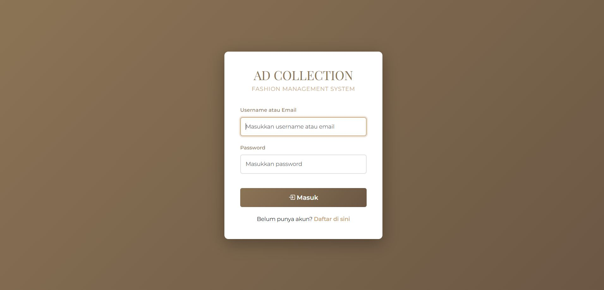

- Dashboard

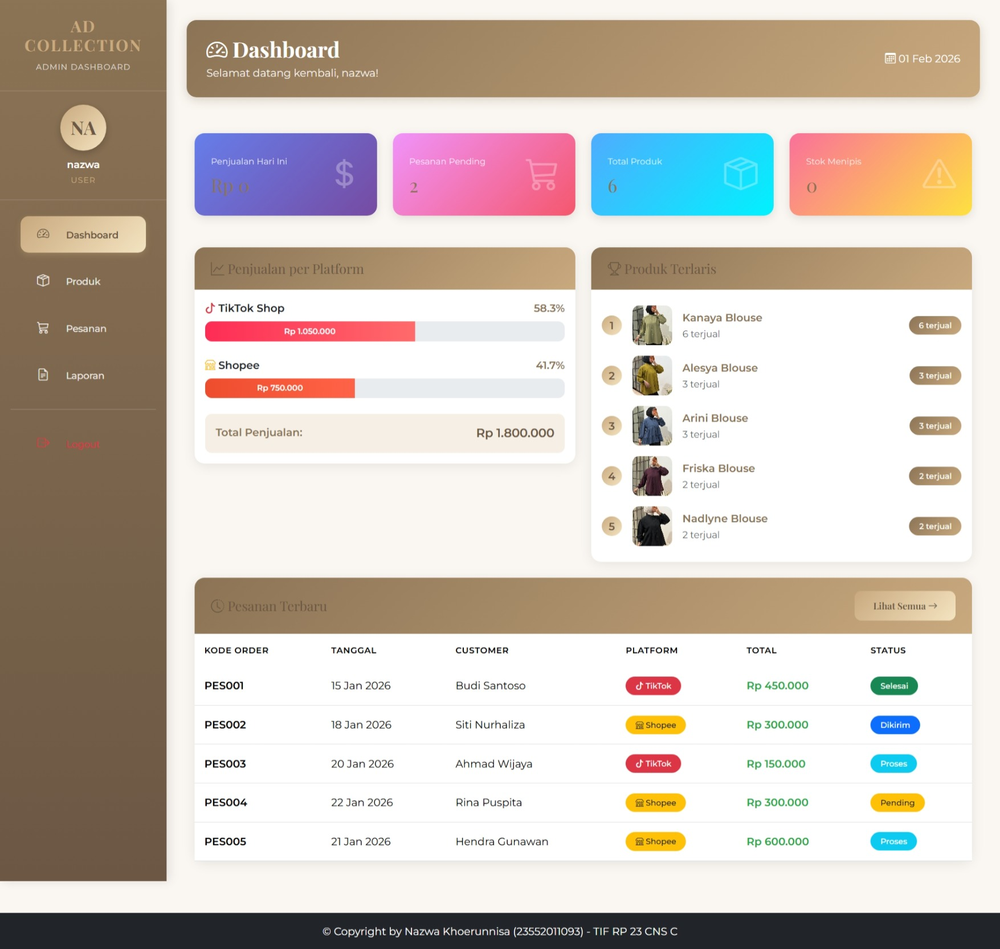

- Produk

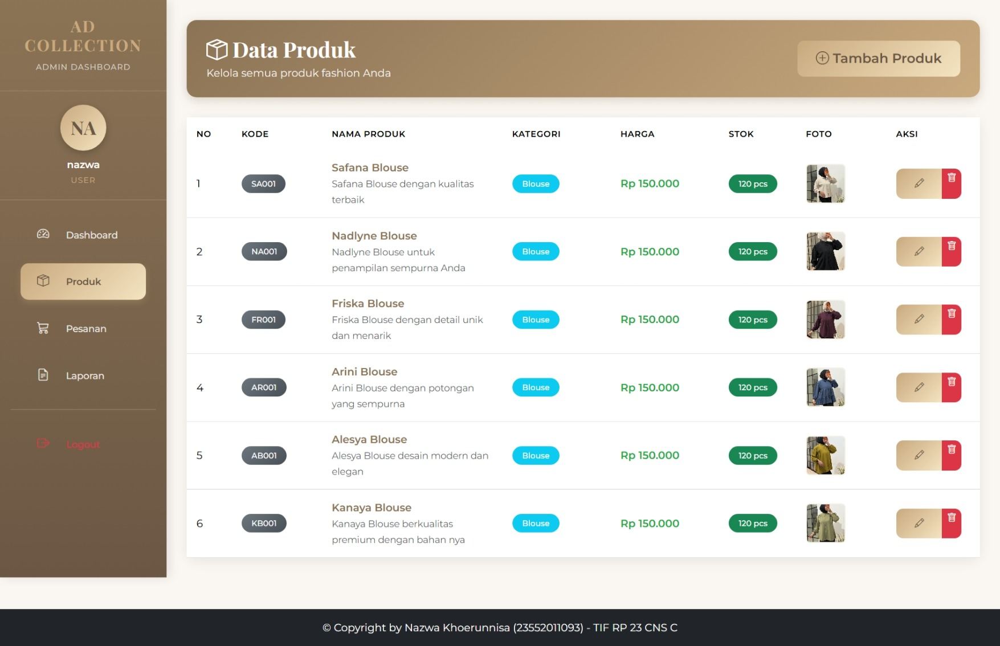

- Register

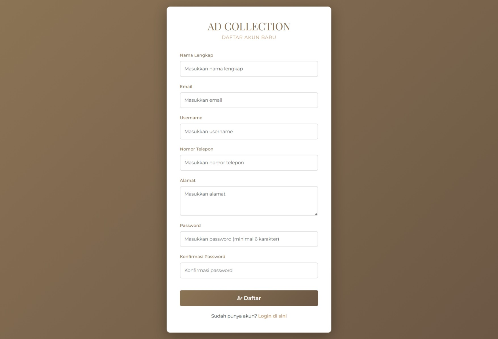

- Tambah Produk


- Tambah Pesanan


- Pesanan (detail/edit)

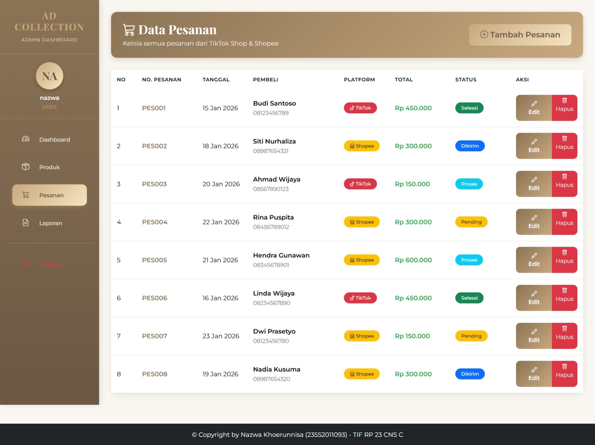

- Landing Page 1

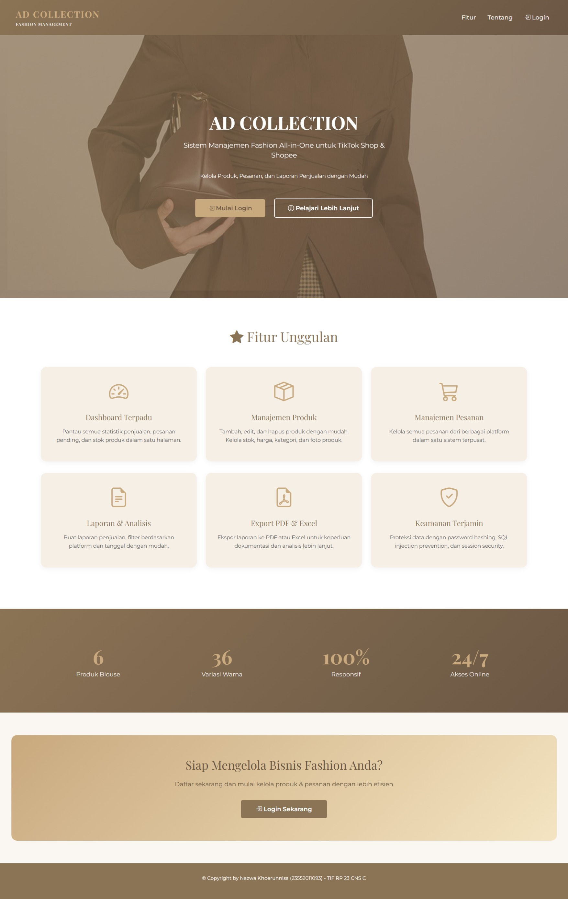

- Landing Page 2

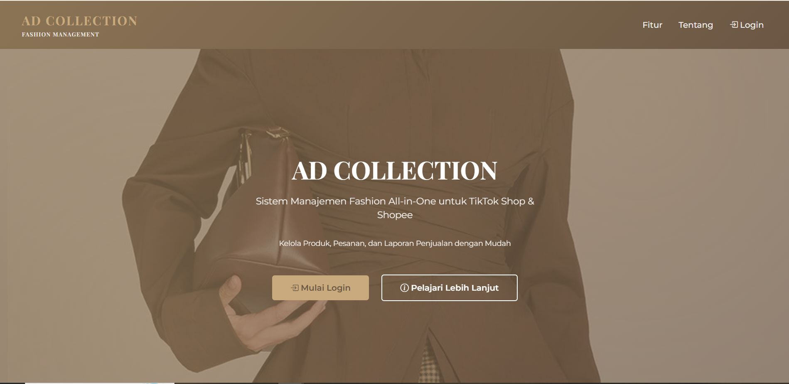

- Landing Page 3

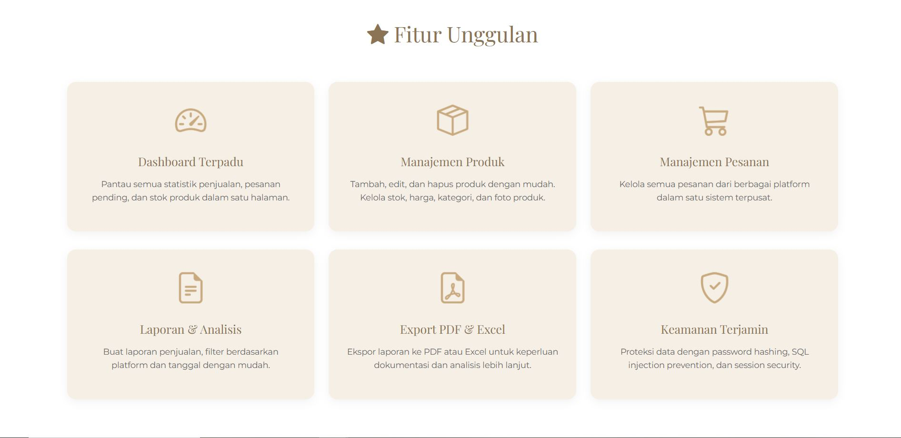

- Landing Page 4

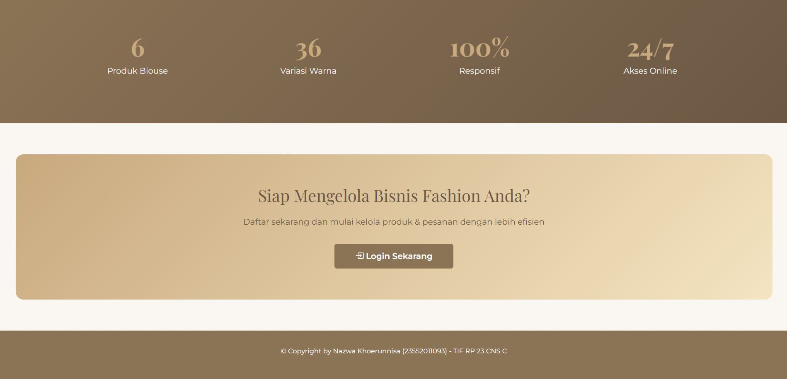

- Laporan


- Export PDF

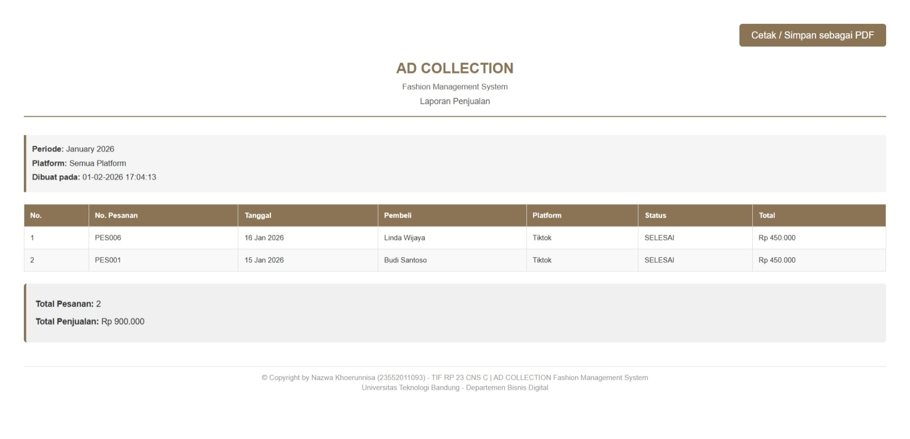

- Export Excel

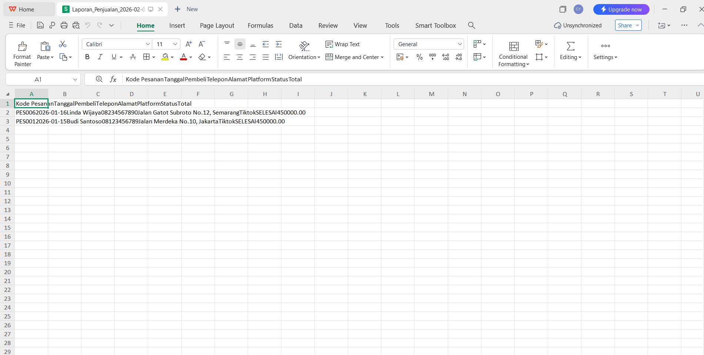

- CSV Laporan (file sampel)

`assets/img/uploads/Laporan_Penjualan_2026-02-01.csv`

## Quick Start (local)

1. Import database:

```bash
mysql -u root < database_setup.sql
```

2. Tempatkan project di folder web server (contoh: `htdocs` atau `www`) lalu buka:

```
http://localhost/UAS-Pemrograman_Web_1/AD-COLLECTION/
```

## Catatan Git/GitHub

Pastikan file `assets/img/uploads/*` ikut di-commit agar screenshot muncul di GitHub README. Jika ingin, jalankan perintah berikut dari root repo:

```bash
git add AD-COLLECTION/README.md
git add AD-COLLECTION/assets/img/uploads/*
git commit -m "Add app README + screenshots"
git push
```

Jika mau, saya bisa bantu menyiapkan branch dan PR, namun saya tidak dapat melakukan push langsung tanpa akses Git Anda.

---

Terakhir diubah: 2026-02-02
